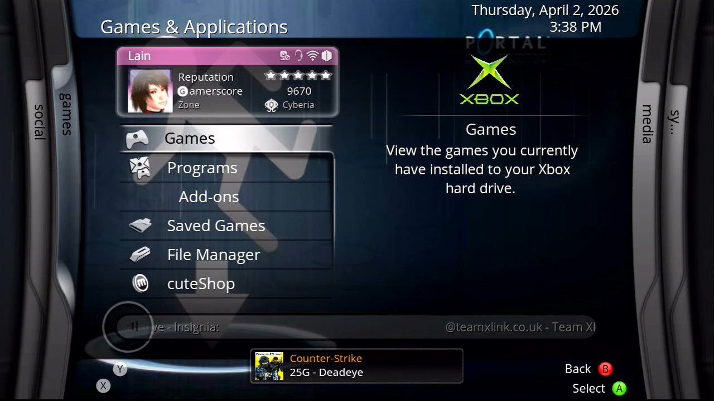
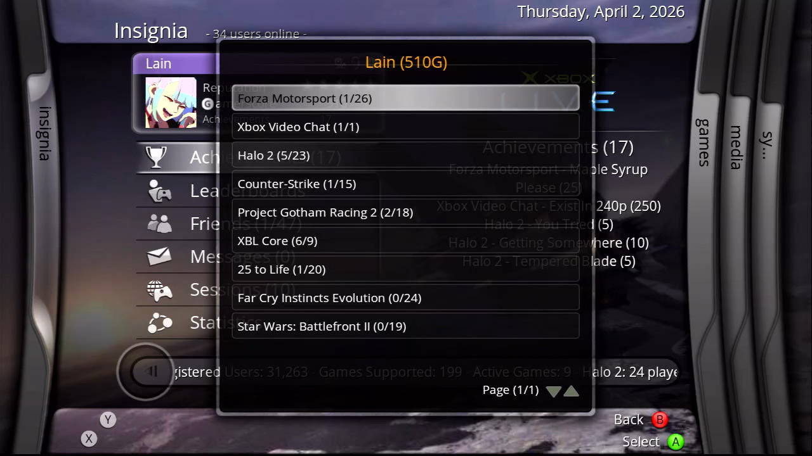
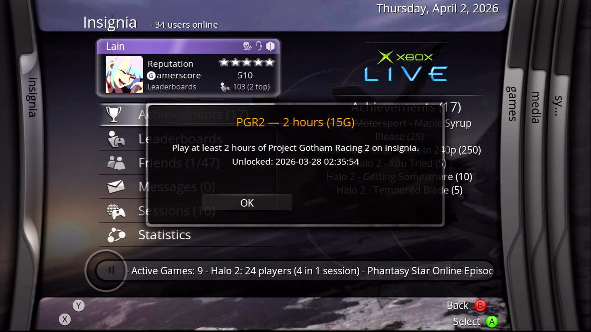

# sakuraRewards

  
<a>
Achievements system for XBMC4Xbox/XBMC4Gamers, powered by xb.live & Insignia statistics.
</a>  

sakuraRewards is an achievement system using the [**xb.live**](https://xb.live) API by [**x11x00x00x**](https://github.com/x11x00x00x) that's designed to be dead-simple to use and configure, no login, no hassle, just achievements for spending time playing some of the best multiplayer games of the sixth generation, and even more for grinding to the top of the leaderboards, letting you brag to your friends about how much better you are than them at pwning noobs in Halo 2, lapping fools in Project Gotham Racing 2, or demolishing them in countless other games, with the list of supported games steadily growing daily as the xb.live team works on new achievements, which apply retroactively as they're released!

sakuraRewards works in two parts, a **notification system**, and an **achievement browser**. Once you've logged into [xb.live](https://xb.live) at least once, and enabled and configured sakuraRewards in the Add-on Manager, sakuraRewards will automatically display every new achievement you receive on system startup as a toast notification, replicating the Xbox 360's achievement notification system. This means that you can spend a few hours grinding the leaderboards of your favourite game, hop back to the dashboard, and watch as the achievements come pouring in. The second stage of sakuraRewards is the achievement browser, which lets you browse your achievements in order of most recent to least recent, letting you view how many achievements you've unlocked in any given game, the amount of total points you've collected, and the exact time you unlocked your achievements, all from your Xbox, for the ultimate distraction-free gaming experience. No phones, no computers, just you, a 10-foot interface, and rewards for sweating it out on the battlefield. 

## How to Install:
- Download and unzip the latest release file
- Log into "[xb.live](https://xb.live)" with your Insignia account at least once to enable playtime tracking
- Copy "script.sakuraRewards" to "Q:/home/addons"
- In XBMC4Xbox/XBMC4Gamers, go into Settings -> Addon Manager, and enable sakuraRewards
- Once enabled, select "Configure", then enter your Insignia gamertag
- Restart your Xbox and watch as you unlock achievements automagically! Any time you boot into XBMC after unlocking an achievement, you'll get a notification for it!
- You can view your achievements at any time by going into Programs -> Addons -> sakuraRewards

## Configuration:
In the add-on settings, you can configure different variables, such as how long every notification should remain on screen (in ms, set to 5000 by default) as well as point style (15G, 15P, 15 points, 15), select your preferred option, get to grinding and watch as the points come in!

## FAQ
- "Do I need to log in on my Xbox?"

Nope! No login is required, simply point the script towards your Insignia gamertag and the xb.live API takes care of the rest. Yes, it's genuinely that easy!
- "Any (planned) support for offline achievements"?

Nope. This add-on specifically uses Insignia multiplayer statistic data and user-created achievements that target those statistics, none of this script is capable of reading offline information, and anything similar for singleplayer would be a Herculean task involving reading/writing memory addresses (not easily possible outside of devkit units) or save data. Even RetroAchievements doesn't have Xbox achievements for emulators, which have a much easier time accessing memory addresses for those types of things.
- "I'm not getting any achievement notifications on login?"

Make sure you've input your Insignia gamertag correctly into the add-on settings, as well as making sure your system is properly connected to the internet. If you're online and still having issues, try deleting "Q:/userdata/addon_data/script.sakuraRewards/achievements.txt" and restarting, this will re-generate your "unlocked achievements" file, which is used to prevent showing duplicate notifications on startup. If you're still having issues, please open an "Issue" thread on this repository, and copy the contents of your "xbmc.log" file from "Q:/home" to assist in debugging what may be going wrong.

## TODO:
- Leaderboard support
- Add the ability to set things such as gamerscore, reputation, achievement totals, etc. as skin stings for skin developers (already implemented, but not in release builds in order to reduce potential bugginess, skin developers can reach out for this version!)

## Credits:
- x11x00x00x - for creating the xb.live API and achievements system that makes this all possible
- Insignia Team - for creating one of the best online service replacements of our genratio
- Jackie - Introducing x11x00x00x & I, teamwork makes the dream work!
